HW 4, pt. 2: Exploring World Bank Data
================
Julia Du

## Load necessary libraries

``` r
library(tidyverse)
```

    ## ── Attaching packages ─────────────────────────────────────── tidyverse 1.3.0 ──

    ## ✓ ggplot2 3.3.3     ✓ purrr   0.3.4
    ## ✓ tibble  3.0.4     ✓ dplyr   1.0.2
    ## ✓ tidyr   1.1.2     ✓ stringr 1.4.0
    ## ✓ readr   1.4.0     ✓ forcats 0.5.0

    ## ── Conflicts ────────────────────────────────────────── tidyverse_conflicts() ──
    ## x dplyr::filter() masks stats::filter()
    ## x dplyr::lag()    masks stats::lag()

``` r
library(ggthemes)
library(ggridges)
library(viridis)
```

    ## Loading required package: viridisLite

``` r
library(forcats)
library(readr)
library(knitr)

theme_set(theme_minimal())
```

## Write a function to import the data files

I’m interested in the following four variables:

    1. Total population growth (annual %) = SP.POP.GROW
    2. Urban population growth (annual %) = SP.URB.GROW
    3. Population density (people per sq. km of land area) = EN.POP.DNST
    4. Life expectancy at birth, total (years) = SP.DYN.LE00.IN

I chose these indicators because I think they could influence each
other.

``` r
import_tidydata <- function(file_name) {
 path = "./data_world_bank/"  
 read_csv(paste0(path, file_name), skip = 4) %>%
   rename(country_name = `Country Name`, country_code = `Country Code`, indicator_name = `Indicator Name`, indicator_code = `Indicator Code`) %>%
   filter(indicator_code %in% c("SP.POP.GROW", "SP.URB.GROW", "EN.POP.DNST", "SP.DYN.LE00.IN")) %>%
   #selecting chosen 4 variables here & not in final select of function so that function (theoretically) runs faster
   select(-c(country_code, indicator_name)) %>%
   pivot_longer(cols = `1960`:`2019`, names_to = "year", values_to = "values") %>%
   pivot_wider(names_from = indicator_code, values_from = values) %>%
   select(-X65)
}

#This is what I used to check my work while creating the function.
sampledfname <- "API_ABW_DS2_en_csv_v2_1226885.csv"
sampledf <- import_tidydata(sampledfname)
```

    ## Warning: Missing column names filled in: 'X65' [65]

    ## 
    ## ── Column specification ────────────────────────────────────────────────────────
    ## cols(
    ##   .default = col_double(),
    ##   `Country Name` = col_character(),
    ##   `Country Code` = col_character(),
    ##   `Indicator Name` = col_character(),
    ##   `Indicator Code` = col_character(),
    ##   X65 = col_logical()
    ## )
    ## ℹ Use `spec()` for the full column specifications.

## Import the data

``` r
# used warning = FALSE & message = FALSE to avoid pages of same message saying it created a new column [X65]
#used cache to avoid redoing import/tidy every time I knitted

masterdata <- list.files(path = "./data_world_bank/", pattern = "\\.csv$") %>% #could also write "*.csv"
map(import_tidydata) %>%
  reduce(rbind) %>%
    mutate(country_name = if_else(country_name == "Korea, Rep.", "South Korea", country_name)) 
#changing name of South Korea now to set up for later analysis
```

## Explore the data

# **East Asian Countries**

My initial analysis focuses on 3 East Asian countries: China, Japan, and
South Korea.

``` r
focus_data <- masterdata %>%
  filter(country_name %in% c("China", "Japan", "South Korea")) %>%
  rename(totalpopgrow = `SP.POP.GROW`, urbpopgrow = `SP.URB.GROW`, popdensity = `EN.POP.DNST`, life_expectancy = `SP.DYN.LE00.IN`)

focus_data %>%
  group_by(country_name) %>%
  drop_na(totalpopgrow:life_expectancy) %>%
  summarize(
    mean(totalpopgrow), mean(urbpopgrow), mean(popdensity), mean(life_expectancy)
    ) %>%
  knitr::kable(
    caption = "Averages of indicators across East Asian countries, from 1960-2020", 
    col.names = c("Country", "Total population growth (%)", "Urban population growth (%)", "Population density (people per sq. km)", "Life expectancy at birth (yrs)"), 
    digits = 2)
```

    ## `summarise()` ungrouping output (override with `.groups` argument)

| Country     | Total population growth (%) | Urban population growth (%) | Population density (people per sq. km) | Life expectancy at birth (yrs) |
| :---------- | --------------------------: | --------------------------: | -------------------------------------: | -----------------------------: |
| China       |                        1.27 |                        3.50 |                                 116.08 |                          66.77 |
| Japan       |                        0.54 |                        1.18 |                                 324.27 |                          77.97 |
| South Korea |                        1.25 |                        3.11 |                                 427.55 |                          70.63 |

Averages of indicators across East Asian countries, from 1960-2020

For all 3 selected East Asian countries, the table shows the average
values of the indicators of interest from 1960 to 2020. On average,
China experienced more population growth – both total and urban – over
the years. However, South Korea has the biggest average population
density, nearly 4x China’s average over the years. Japan had the highest
average life expectancy at birth, roughly 78 years, which is 10 years
more than China’s average life expectancy.

# **3 Geographical Regions (9 total countries)**

I started my analysis just focusing on the 3 East Asian countries above,
but I realized I could look at *regions*. I focused on 3 geographical
regions: East Asia (same as above), North America (Mexico, Canada, US),
and Western Europe (France, Germany, UK).

``` r
#compare geographical regions
require(forcats)

e_asia <- c("China", "Japan", "South Korea")
n_ame <- c("Mexico", "Canada", "United States")
w_eur <- c("France", "Germany", "United Kingdom")

region_level <- c(e_asia, n_ame, w_eur)
  #"East Asia", "North America", "Western Europe")

regional_data <- masterdata %>%
  filter(country_name %in% c(e_asia, n_ame, w_eur)) %>%
  rename(
    totalpopgrow = `SP.POP.GROW`, 
    urbpopgrow = `SP.URB.GROW`, 
    popdensity = `EN.POP.DNST`, 
    life_expectancy = `SP.DYN.LE00.IN`) %>%
  mutate(region = case_when(
    country_name %in% e_asia ~ "East Asia",
    country_name %in% n_ame ~ "North America",
    country_name %in% w_eur ~ "Western Europe"
  )) %>%
  mutate(country_name = factor(country_name, levels = region_level), country_name = fct_rev(country_name))

#table of mean indicators across region
regional_data %>%
  group_by(region) %>%
  drop_na(totalpopgrow:life_expectancy) %>%
  summarize(
    mean(totalpopgrow), mean(urbpopgrow), mean(popdensity), mean(life_expectancy)
    ) %>%
  knitr::kable(
    caption = "Averages of indicators across region, from 1960-2020", 
    col.names = c("Region", "Total population growth (%)", "Urban population growth (%)", "Population density (people per sq. km)", "Life expectancy at birth (yrs)"), 
    digits = 2)
```

    ## `summarise()` ungrouping output (override with `.groups` argument)

| Region         | Total population growth (%) | Urban population growth (%) | Population density (people per sq. km) | Life expectancy at birth (yrs) |
| :------------- | --------------------------: | --------------------------: | -------------------------------------: | -----------------------------: |
| East Asia      |                        1.02 |                        2.60 |                                 289.30 |                          71.79 |
| North America  |                        1.45 |                        1.90 |                                  24.39 |                          73.61 |
| Western Europe |                        0.42 |                        0.65 |                                 191.65 |                          75.86 |

Averages of indicators across region, from 1960-2020

``` r
# violinplot of life_expectancy - all countries
regional_data %>%
  ggplot(mapping = aes(x = country_name, y = life_expectancy, fill = region)) +
  geom_violin() +
  geom_boxplot(width=0.1, color="grey", alpha=0.2) +
    labs(title = "Life expectancy in selected countries, 1960-2020", 
         x = "", 
         y = "Life expectancy at birth (yrs)", 
         caption = 
           "Source: The World Bank", 
         fill = "Region") +
  theme(legend.position = "bottom") +
  coord_flip()
```

    ## Warning: Removed 9 rows containing non-finite values (stat_ydensity).

    ## Warning: Removed 9 rows containing non-finite values (stat_boxplot).

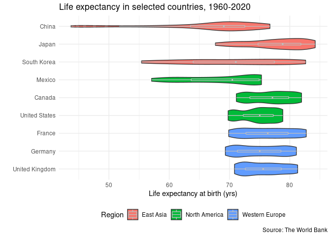<!-- -->

``` r
#violin plot of regional life expectancy
ggplot(data = regional_data, mapping = aes(x = region, y = life_expectancy, fill = region)) +
  geom_violin() +
  geom_boxplot(width=0.1, color="grey", alpha=0.2) +
    labs(title = "Life expectancy in selected regions, 1960-2020", 
         x = "", y = "Life expectancy at birth (yrs)", 
         caption = "Source: The World Bank", 
         fill = "Country") +
  scale_y_continuous(limits = c(40, 90)) +
  theme(legend.position = "none")
```

    ## Warning: Removed 9 rows containing non-finite values (stat_ydensity).
    
    ## Warning: Removed 9 rows containing non-finite values (stat_boxplot).

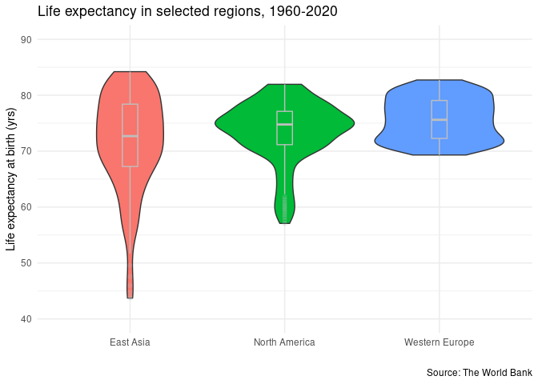<!-- -->

``` r
#ridged population density - all countries
ggplot(data = regional_data, mapping = aes(x = popdensity, y = country_name, fill = region)) +
  geom_density_ridges(alpha = 0.6) +
  scale_fill_viridis(discrete = TRUE) +
  scale_color_viridis(discrete = TRUE) +
    labs(title = "Population density in selected countries, 1960-2020", 
         x = "Population density (people per sq. km)", 
         y = "", 
         caption = "Source: The World Bank", 
         fill = "Country") +
  theme(legend.position = "none")
```

    ## Picking joint bandwidth of 7.96

    ## Warning: Removed 18 rows containing non-finite values (stat_density_ridges).

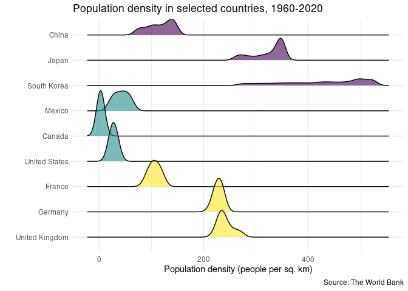<!-- -->

``` r
#ridged pop density - regions
ggplot(data = regional_data, mapping = aes(x = popdensity, y = fct_rev(region), fill = region)) +
  geom_density_ridges(alpha = 0.6) +
  scale_fill_viridis(discrete = TRUE) +
  scale_color_viridis(discrete = TRUE) +
    labs(title = "Population density in selected regions, 1960-2020", 
         x = "Population density (people per sq. km)", 
         y = "", 
         caption = "Source: The World Bank", 
         fill = "Country") +
  theme(legend.position = "none")
```

    ## Picking joint bandwidth of 23.4

    ## Warning: Removed 18 rows containing non-finite values (stat_density_ridges).

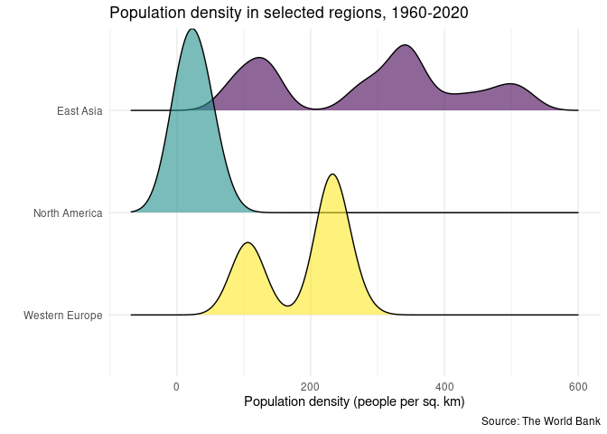<!-- -->

I first created a similar table to the East Asian table for these 3
geographical regions. The East Asian countries had a much higher average
population density and a higher average annual urban population growth
rate over 1960-2020. I didn’t expect this, but North America had the
highest average annual total population growth rate. Finally, Western
Europe had the highest average life expectancy at roughly 76 years.

*I then created two violin plots to analyze life expectancy from our
data covering 1960-2020.* The **first violin plot** looks at all 9
countries. Upon first glance, China is skewed a lot to the left and has
the lowest median life expectancy (a little under 70 years). This seems
logical, as China was largely rural with limited medical services prior
to the Communist Revolution and is still undergoing rural revitalization
programs today. Mexico is also skewed to the left, and the other East
Asian countries seem to also be slightly left-skewed. Out of all the
countries, Japan does seem to have the highest median life expectancy
over the time range this data was collected. Interestingly, the Western
European countries seems to be relatively centered and not skewed. The
Western European countries, alongside the US & Canada, seem to have
pretty similar median life expectancies. The **second violin plot**
consolidates some of the trends described above: East Asian countries
are left-skewed, while Western Europe is more centered. North America is
also skewed to the left, likely influenced largely by Mexico’s
left-skewness. Overall, Western Europe has the highest regional median
life expectancy, and East Asia has the lowest.

*I also created 2 ridgeline plots to analyze population density.* The
**1st ridgeline plot** covers all 9 countries. We see a clustering of
North American countries at low population densities, roughly 50 people
per sq. km. The Western European countries have comparatively higher
densities and are less clustered together, with France having noticeably
lower population densities than its peers. The East Asian countries are
even less clustered together, with China surprisingly centered around a
population density of 100-125 people per sq. km. South Korea has a lot
of spread and lacks a clear center population density over the years.
The **2nd ridgeline plot** consolidates the above trends. Since the
North American countries were very close together, there is a clear
center population density (which is the lowest out of all 3 regions).
Western Europe has 2 peaks, since France had a much lower population
density than the UK & Germany. East Asia has many peaks: all 3 countries
had multiple peaks and South Korea in particular was extremely spread
out, so there is no clear peak. East Asia does have some of the highest
population densities, but it also had some very low densities, even
overlapping a little into North America’s low densities.

# **Indicators over Time - 3 geographical regions**

``` r
#line graphs of 3 regions, tracking variables over time

#population density over time
regional_data %>%
  ggplot(mapping = aes(x = year, y = popdensity, color = fct_rev(country_name), group = country_name)) +
  geom_line() +
  facet_wrap(region ~ .)  +
  labs(title = "Population density, 1960-2020", 
       subtitle = "In selected countries", 
       x = "Year", 
       y = "Population density (people per sq. km)", 
       caption = "Source: The World Bank", 
       color = "Country") +
  scale_x_discrete(breaks = seq(1960, 2020, by = 10)) +
  theme(legend.position = "bottom")
```

    ## Warning: Removed 18 row(s) containing missing values (geom_path).

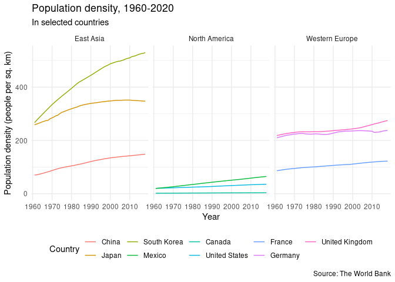<!-- -->

``` r
#life expectancy over time
regional_data %>%
  ggplot(mapping = aes(x = year, y = life_expectancy, color = fct_rev(country_name), group = country_name)) +
  geom_line() +
  facet_wrap(region ~ .)  +
  labs(title = "Life expectancy, 1960-2020", 
       subtitle = "In selected countries", 
       x = "Year", 
       y = "Life expectancy, at birth (yrs)", 
       caption = "Source: The World Bank", 
       color = "Country") +
  scale_x_discrete(breaks = seq(1960, 2020, by = 10)) +
  theme(legend.position = "bottom")
```

    ## Warning: Removed 9 row(s) containing missing values (geom_path).

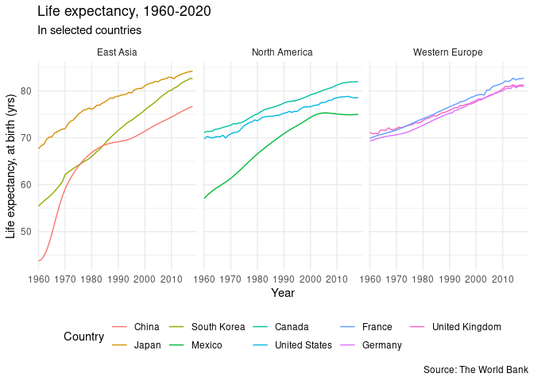<!-- -->

``` r
#total population growth rates over time
regional_data %>%
  ggplot(mapping = aes(x = year, y = totalpopgrow/100, color = fct_rev(country_name), group = country_name)) +
  geom_line() +
  facet_wrap(region ~ .)  +
  labs(title = "Total population growth, 1960-2020", 
       subtitle = "In selected countries", 
       x = "Year", 
       y = "Total population growth", 
       caption = "Source: The World Bank", 
       color = "Country") +
  scale_x_discrete(breaks = seq(1960, 2020, by = 10)) +
  scale_y_continuous(labels = scales::percent) +
  theme(legend.position = "bottom")
```

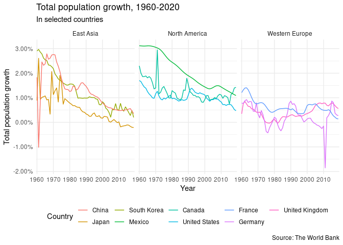<!-- -->

``` r
#comparing total pop growth to urban pop grow over time
ggplot(data = regional_data, mapping = aes(x = year)) +
  geom_line(mapping = aes(y = totalpopgrow/100, color = "Total population"), group = 1) +
  geom_line(mapping = aes(y = urbpopgrow/100, color = "Urban population"), group = 1) +
  facet_wrap(fct_rev(country_name) ~.) +
    labs(title = "Total & Urban Population Growth, 1960-2020", 
         subtitle = "In selected countries", 
         x = "Year", 
         y = "Percent of growth", 
         caption = "Source: The World Bank", 
         color = "") +
  scale_x_discrete(breaks = seq(1960, 2020, by = 10)) +
  scale_y_continuous(labels = scales::percent) +
  theme(legend.position = "bottom")
```

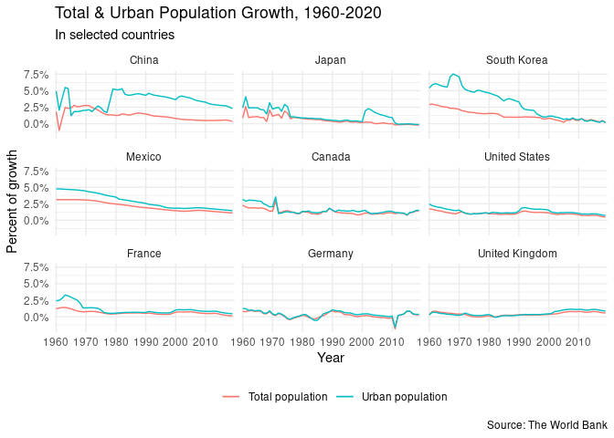<!-- -->

*I continued to analyze my indicators of interest, this time using
**line graphs to see how they evolved over time.***

Most of the 9 countries seemed to at least somewhat increase their
**population densities** over time, though Canada barely changed its
extremely low density over time. Germany also stays relatively stagnant,
hovering around a density of 225 people per sq. km. South Korea in
particular has a giant increase in population density, going from 250
people per sq. km in 1960 to 525 people per sq. km about sixty years
later. East Asian countries (namely Japan and South Korea) clearly have
higher population densities, while North American countries have the
lowest (as noted in the earlier ridgeline graphs).

We can see that Western Europe’s **life expectancies** have roughly
stayed together over time, whereas North American countries were
slightly diverged (though they are getting closer as time goes on). The
East Asian countries’ life expectancies are even more divergent. In all
regions here, we see an increase in life expectancy over time, with East
Asian countries experiencing the most dramatic change (as China and
South Korea started with noticeably lower expectancies). Today, we see
roughly similar life expectancies for all countries, hovering around 80
yrs. Japan and South Korea (with modern life expectancies around 82
years) have actually surpassed the North American and Western European
countries, while China and Mexico lag behind (around 75 years).

For all countries, we see a general slowing in the **total population
growth rate** over time, but the rate stays positive for the most part.
However, China seems to have decreased its population in the early 1960s
(i.e. a negative growth rate), while Germany also experienced decreases
in the early 2010s (due to a declining birth rate). Today, Japan, South
Korea, France, and Germany – which have all been in the news for their
declining birth rates – have very low total population growth rates,
roughly less than 0.5%. Mexico has the highest total population growth
rate today, a little over 1%, but that is still much lower than its
historical rates. Historically, Western Europe seemed to have lower
rates than the other 2 regions, but East Asia’s growth rates have
decreased so much over the years that in modern times, East Asia and
Western Europe have similar total population growth rates.

In general, it seems that **urban and total population growth rates**
have both been slowing over time, but urban growth rates typically stay
a bit higher than total growth rates. The total and urban growth rates
of Germany, the UK, and the US track quite closely together. South Korea
had a noticeably higher urban rate than its total rate from 1960 to
1990. Strangely, China’s urban rate dipped below its total population
rate from 1965 to 1975 – this may be due to Cultural Revolution
programs, one of which compelled (urban-based) scholars to work in the
countryside.

# **Indicator Relationships**

``` r
#relationships between indicators
ggplot(data = regional_data, mapping = aes(x = totalpopgrow/100, y = urbpopgrow/100)) +
  geom_line() +
  facet_wrap(fct_rev(country_name) ~.) +
    labs(title = "Total vs. Urban Population Growth, 1960-2020", 
         subtitle = "In selected countries", 
         x = "Percent of total population growth", 
         y = "Percent of urban population growth", 
         caption = "Source: The World Bank", 
         color = "Country") +
  scale_y_continuous(labels = scales::percent) + 
  scale_x_continuous(labels = scales::percent) 
```

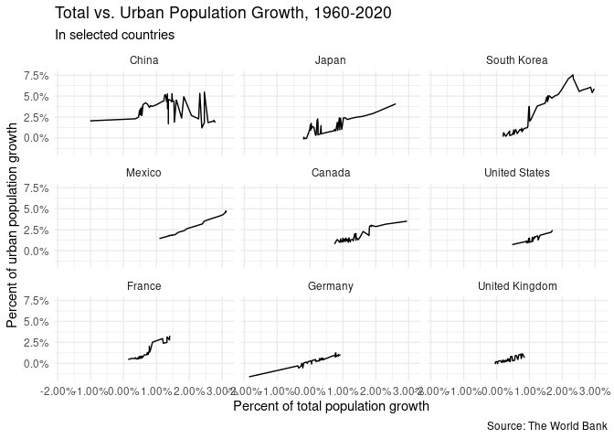<!-- -->

``` r
ggplot(data = regional_data, mapping = aes(x = life_expectancy, y = totalpopgrow/100)) +
  geom_line() +
  facet_wrap(fct_rev(country_name) ~.) +
    labs(title = "Life Expectancy vs. Total Population Growth, 1960-2020", 
         subtitle = "In selected countries", 
         x = "Life expectancy (yrs)", 
         y = "Percent of total population growth", 
         caption = "Source: The World Bank", 
         color = "Country") +
  scale_y_continuous(labels = scales::percent) 
```

    ## Warning: Removed 1 row(s) containing missing values (geom_path).

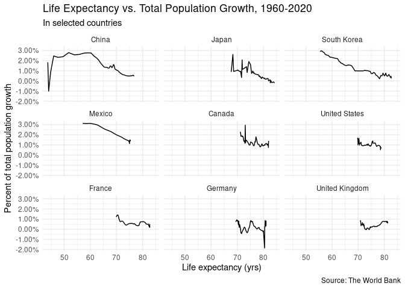<!-- -->

``` r
ggplot(data = regional_data, mapping = aes(x = life_expectancy, y = popdensity, color = fct_rev(country_name), group = country_name)) +
  geom_line() +
    labs(title = "Life Expectancy vs. Population Density, 1960-2020", 
         subtitle = "In selected countries", 
         x = "Life expectancy (yrs)", 
         y = "Population density (people per sq. km)", 
         caption = "Source: The World Bank", 
         color = "Country")
```

    ## Warning: Removed 17 row(s) containing missing values (geom_path).

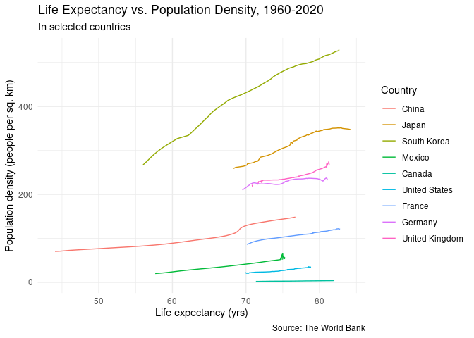<!-- -->

As expected and noted earlier, **urban and total population growth
rates** generally move together, producing the **positively correlated
relationship** we see here. The exception, also mentioned earlier, is
China: there is a section where these two indicators are negatively
correlated (i.e. total growth increased, but urban growth decreased).

Generally, it seems that there is a **negative correlation between life
expectancy and total population growth** (though there is admittedly a
lot of fluctuation). This could be because as people are able to live
for longer periods of time, there’s less room for new people to be born
or come in – so populations grow slower as existing residents age.

There seems to be a **positive correlation between life expectancy and
population density.** As people live longer, there are more existing
residents in a country at a given time. As babies continue to be born
and immigrants continue to move in – but fewer people die out due to old
age – the amount of people in a given area increases, i.e. population
density.

## Session info

``` r
devtools::session_info()
```

    ## ─ Session info ───────────────────────────────────────────────────────────────
    ##  setting  value                               
    ##  version  R version 4.0.1 (2020-06-06)        
    ##  os       Red Hat Enterprise Linux 8.3 (Ootpa)
    ##  system   x86_64, linux-gnu                   
    ##  ui       X11                                 
    ##  language (EN)                                
    ##  collate  en_US.UTF-8                         
    ##  ctype    en_US.UTF-8                         
    ##  tz       America/Chicago                     
    ##  date     2021-02-06                          
    ## 
    ## ─ Packages ───────────────────────────────────────────────────────────────────
    ##  package     * version date       lib source        
    ##  assertthat    0.2.1   2019-03-21 [2] CRAN (R 4.0.1)
    ##  backports     1.2.1   2020-12-09 [2] CRAN (R 4.0.1)
    ##  broom         0.7.3   2020-12-16 [2] CRAN (R 4.0.1)
    ##  callr         3.5.1   2020-10-13 [2] CRAN (R 4.0.1)
    ##  cellranger    1.1.0   2016-07-27 [2] CRAN (R 4.0.1)
    ##  cli           2.2.0   2020-11-20 [2] CRAN (R 4.0.1)
    ##  colorspace    2.0-0   2020-11-11 [2] CRAN (R 4.0.1)
    ##  crayon        1.3.4   2017-09-16 [2] CRAN (R 4.0.1)
    ##  DBI           1.1.0   2019-12-15 [2] CRAN (R 4.0.1)
    ##  dbplyr        2.0.0   2020-11-03 [2] CRAN (R 4.0.1)
    ##  desc          1.2.0   2018-05-01 [2] CRAN (R 4.0.1)
    ##  devtools      2.3.2   2020-09-18 [1] CRAN (R 4.0.1)
    ##  digest        0.6.27  2020-10-24 [2] CRAN (R 4.0.1)
    ##  dplyr       * 1.0.2   2020-08-18 [2] CRAN (R 4.0.1)
    ##  ellipsis      0.3.1   2020-05-15 [2] CRAN (R 4.0.1)
    ##  evaluate      0.14    2019-05-28 [2] CRAN (R 4.0.1)
    ##  fansi         0.4.1   2020-01-08 [2] CRAN (R 4.0.1)
    ##  farver        2.0.3   2020-01-16 [2] CRAN (R 4.0.1)
    ##  forcats     * 0.5.0   2020-03-01 [2] CRAN (R 4.0.1)
    ##  fs            1.5.0   2020-07-31 [2] CRAN (R 4.0.1)
    ##  generics      0.1.0   2020-10-31 [2] CRAN (R 4.0.1)
    ##  ggplot2     * 3.3.3   2020-12-30 [2] CRAN (R 4.0.1)
    ##  ggridges    * 0.5.3   2021-01-08 [1] CRAN (R 4.0.1)
    ##  ggthemes    * 4.2.4   2021-01-20 [1] CRAN (R 4.0.1)
    ##  glue          1.4.2   2020-08-27 [2] CRAN (R 4.0.1)
    ##  gridExtra     2.3     2017-09-09 [2] CRAN (R 4.0.1)
    ##  gtable        0.3.0   2019-03-25 [2] CRAN (R 4.0.1)
    ##  haven         2.3.1   2020-06-01 [2] CRAN (R 4.0.1)
    ##  highr         0.8     2019-03-20 [2] CRAN (R 4.0.1)
    ##  hms           0.5.3   2020-01-08 [2] CRAN (R 4.0.1)
    ##  htmltools     0.4.0   2019-10-04 [2] CRAN (R 4.0.1)
    ##  httr          1.4.2   2020-07-20 [2] CRAN (R 4.0.1)
    ##  jsonlite      1.7.2   2020-12-09 [2] CRAN (R 4.0.1)
    ##  knitr       * 1.30    2020-09-22 [2] CRAN (R 4.0.1)
    ##  labeling      0.4.2   2020-10-20 [2] CRAN (R 4.0.1)
    ##  lifecycle     0.2.0   2020-03-06 [2] CRAN (R 4.0.1)
    ##  lubridate     1.7.9.2 2020-11-13 [2] CRAN (R 4.0.1)
    ##  magrittr      2.0.1   2020-11-17 [2] CRAN (R 4.0.1)
    ##  memoise       1.1.0   2017-04-21 [2] CRAN (R 4.0.1)
    ##  modelr        0.1.8   2020-05-19 [2] CRAN (R 4.0.1)
    ##  munsell       0.5.0   2018-06-12 [2] CRAN (R 4.0.1)
    ##  pillar        1.4.7   2020-11-20 [2] CRAN (R 4.0.1)
    ##  pkgbuild      1.2.0   2020-12-15 [2] CRAN (R 4.0.1)
    ##  pkgconfig     2.0.3   2019-09-22 [2] CRAN (R 4.0.1)
    ##  pkgload       1.1.0   2020-05-29 [2] CRAN (R 4.0.1)
    ##  plyr          1.8.6   2020-03-03 [2] CRAN (R 4.0.1)
    ##  prettyunits   1.1.1   2020-01-24 [2] CRAN (R 4.0.1)
    ##  processx      3.4.5   2020-11-30 [2] CRAN (R 4.0.1)
    ##  ps            1.5.0   2020-12-05 [2] CRAN (R 4.0.1)
    ##  purrr       * 0.3.4   2020-04-17 [2] CRAN (R 4.0.1)
    ##  R6            2.5.0   2020-10-28 [2] CRAN (R 4.0.1)
    ##  Rcpp          1.0.5   2020-07-06 [2] CRAN (R 4.0.1)
    ##  readr       * 1.4.0   2020-10-05 [2] CRAN (R 4.0.1)
    ##  readxl        1.3.1   2019-03-13 [2] CRAN (R 4.0.1)
    ##  remotes       2.2.0   2020-07-21 [2] CRAN (R 4.0.1)
    ##  reprex        0.3.0   2019-05-16 [1] CRAN (R 4.0.1)
    ##  rlang         0.4.10  2020-12-30 [2] CRAN (R 4.0.1)
    ##  rmarkdown     2.6     2020-12-14 [2] CRAN (R 4.0.1)
    ##  rprojroot     2.0.2   2020-11-15 [2] CRAN (R 4.0.1)
    ##  rstudioapi    0.13    2020-11-12 [2] CRAN (R 4.0.1)
    ##  rvest         0.3.6   2020-07-25 [2] CRAN (R 4.0.1)
    ##  scales        1.1.1   2020-05-11 [2] CRAN (R 4.0.1)
    ##  sessioninfo   1.1.1   2018-11-05 [2] CRAN (R 4.0.1)
    ##  stringi       1.5.3   2020-09-09 [2] CRAN (R 4.0.1)
    ##  stringr     * 1.4.0   2019-02-10 [2] CRAN (R 4.0.1)
    ##  testthat      3.0.1   2020-12-17 [2] CRAN (R 4.0.1)
    ##  tibble      * 3.0.4   2020-10-12 [2] CRAN (R 4.0.1)
    ##  tidyr       * 1.1.2   2020-08-27 [2] CRAN (R 4.0.1)
    ##  tidyselect    1.1.0   2020-05-11 [2] CRAN (R 4.0.1)
    ##  tidyverse   * 1.3.0   2019-11-21 [1] CRAN (R 4.0.1)
    ##  usethis       2.0.0   2020-12-10 [1] CRAN (R 4.0.1)
    ##  vctrs         0.3.6   2020-12-17 [2] CRAN (R 4.0.1)
    ##  viridis     * 0.5.1   2018-03-29 [1] CRAN (R 4.0.1)
    ##  viridisLite * 0.3.0   2018-02-01 [2] CRAN (R 4.0.1)
    ##  withr         2.3.0   2020-09-22 [2] CRAN (R 4.0.1)
    ##  xfun          0.19    2020-10-30 [2] CRAN (R 4.0.1)
    ##  xml2          1.3.2   2020-04-23 [2] CRAN (R 4.0.1)
    ##  yaml          2.2.1   2020-02-01 [2] CRAN (R 4.0.1)
    ## 
    ## [1] /home/duj/R/x86_64-pc-linux-gnu-library/4.0
    ## [2] /opt/R/4.0.1/lib/R/library
